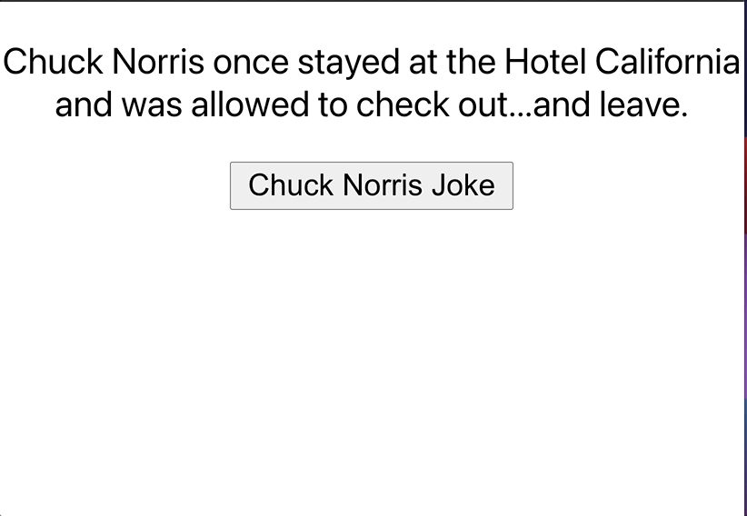

# Joke app



Technology:

- ajax with react

## setup class JokeApp Component

First, we need to create a class for our component. Then initiate joke state inside of `constructor` and pass it `render()` function.

```jsx
import React, { Component } from "react";

class JokeApp extends Component {
  constructor(props) {
    super(props);

    this.state = {
      joke: "",
    };
  }

  render() {
    return (
      <div>
        <p>{this.state.joke}</p>
      </div>
    );
  }
}

export default JokeApp;
```

## Add `_fetchJoke()`:
- url: https://api.chucknorris.io/jokes/search?query=california

- fetch() send request API start promise-chaining.
there are two .then().  First .then() gets called once Resp is received then converts => JSON (response.json()
Second .then() gets called once JSON OBJ is received then store to state.joke.

```json
{
"total": 11,
"result": [
  {
    "categories": [],
    "created_at": "2020-01-05 13:42:19.897976",
    "icon_url": "https://assets.chucknorris.host/img/avatar/chuck-norris.png",
    "id": "Ugi3zbpTQUK-CjE7nNz_Ug",
    "updated_at": "2020-01-05 13:42:19.897976",
    "url": "https://api.chucknorris.io/jokes/Ugi3zbpTQUK-CjE7nNz_Ug",
    "value": "The California Redwood forest is Chuck Norris toothpick factory"
  },{},{},]
```
```js
_fetchJoke = () => {
  const jokeUrl = "https://api.chucknorris.io/jokes/search?query=california";
  fetch(jokeUrl)
    .then((response) => response.json())
    .then((jokeJson) => {
      console.log("jokeJson: =>", jokeJson);
      console.log(jokeJson.result[0].value);
      // put the text of joke in state
      this.setState(
        {
          joke: jokeJson.result[0].value,
        },
        () => {
          console.log("New Joke stored");
        }
      );
    });
};

// Play around in the console and see the new joke
debugger;
const jokeUrl = "https://api.chucknorris.io/jokes/search?query=california";
fetch(jokeUrl)
  .then(response => response.json())
  .then(jokeJson => {
    debugger;
    console.log('jokeJson: =>', jokeJson);
    // put the text of joke in state

  });
```

- Drill down to one joke: jokeJson.result[0].value

* calling `_fetchJoke()`:

```js
render() {
    return (
      <div>
        <p>{this.state.joke}</p>
        <button onClick={this._fetchJoke}>Chuck Norris Joke</button>
      </div>
    );
  }
```
## Joke is loading...
Add isLoading to state obj with initial value of false. (default is not loading, loading gif won't show)
If loading => gif of loading
else => show the joke since done loading!

Note: I must use ternary inside `JSX`, if-else statement is not an expression and doesn't resolve to a single value

```js
render() {
    return (
      <div>
        <p>{this.state.isLoading ?   : this.state.joke}</p>
        <button onClick={this._fetchJoke}>Chuck Norris Joke</button>
      </div>
    );
```

Then update the isLoading inside of _fetchJoke() method.
Once you setState `isLoading: true`, place fetch api call inside of the `setState` of isLoading.

```jsx
_fetchJoke = () => {
    this.setState(
      {
        isLoading: true,
      },
      () => {
        // inside of setState cb ensure isLoading is set to true before making api call
        const jokeUrl =
          "https://api.chucknorris.io/jokes/search?query=california";

        fetch(jokeUrl)
          .then((response) => response.json())
          .then((jokeJson) => {
            const maxNum = jokeJson.total; // total # of joke
            const randomNum = Math.floor(Math.random() * maxNum); // random number start: 0 end: maxNum

            console.log(jokeJson.result[randomNum].value);
            // put the text of joke in state
            this.setState(
              {
                joke: jokeJson.result[randomNum].value,
                isLoading: false,
              },
              () => {
                console.log("New Joke stored");
              }
            );
          });
      }
    );
  };
```

### final
```jsx
class JokeApp extends Component {
  constructor(props) {
    super(props);

    this.state = {
      joke: "",
      isLoading: false,
    };
  }

  render() {
    return (
      <div>
        <p>
          {this.state.isLoading ? (
            
          ) : (
            this.state.joke
          )}
        </p>
        <button onClick={this._fetchJoke}>Chuck Norris Joke</button>
      </div>
    );
  }

  _fetchJoke = () => {
    this.setState(
      {
        isLoading: true,
      },
      () => {
        // inside of setState cb ensure isLoading is set to true before making api call
        const jokeUrl =
          "https://api.chucknorris.io/jokes/search?query=california";

        fetch(jokeUrl)
          .then((response) => response.json())
          .then((jokeJson) => {
            const maxNum = jokeJson.total; // total # of joke
            const randomNum = Math.floor(Math.random() * maxNum); // random number start: 0 end: maxNum

            console.log(jokeJson.result[randomNum].value);
            // put the text of joke in state
            this.setState(
              {
                joke: jokeJson.result[randomNum].value,
                isLoading: false,
              },
              () => {
                console.log("New Joke stored");
              }
            );
          });
      }
    );
  };
}

export default JokeApp;
```